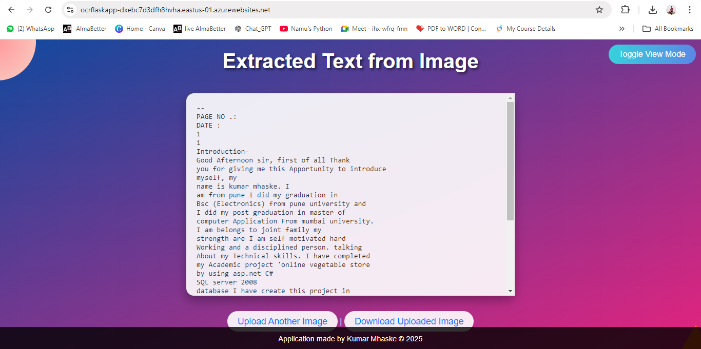

# OCR Flask Application

A web application built using **Flask** that integrates **Azure Computer Vision API** to perform **Optical Character Recognition (OCR)** on images. The application allows users to upload images, extract text, and download the results. It's deployed on **Azure App Service** for easy access and scalability.

## Features

- Upload images through a simple web interface
- Extract text from images using Azure Computer Vision OCR API
- Download the uploaded image after processing
- Easy to use and lightweight Flask app
- Hosted on Azure App Service

## Technologies Used

- **Flask**: Web framework for building the application
- **Azure Computer Vision API**: Used for performing OCR on uploaded images
- **HTML/CSS**: For creating the front-end interface
- **JavaScript**: To handle image uploads
- **Python**: Backend programming language
- **Pillow**: Python Imaging Library for image handling
- **GitHub Actions**: Continuous integration and deployment

## Requirements

- Python 3.6+
- Flask
- Azure SDK (`azure-cognitiveservices-vision`)
- Pillow

## Installation

To run this application locally:

1. Clone the repository:

   ```bash
   git clone https://github.com/your-github-username/OCR-Flask-Application.git
   ```

2. Navigate into the project directory:

   ```bash
   cd OCR-Flask-Application
   ```

3. Create a virtual environment:

   ```bash
   python -m venv venv
   ```

4. Activate the virtual environment:

   - On Windows:

     ```bash
     .\venv\Scripts\activate
     ```

   - On macOS/Linux:

     ```bash
     source venv/bin/activate
     ```

5. Install the required dependencies:

   ```bash
   pip install -r requirements.txt
   ```

6. Set up your Azure Computer Vision API key and endpoint as environment variables:

   ```bash
   export COMPUTER_VISION_KEY="your_key"
   export COMPUTER_VISION_ENDPOINT="your_endpoint"
   ```

   On Windows, use `set` instead of `export`.

7. Run the application:

   ```bash
   python app.py
   ```

8. Access the app in your browser at `http://127.0.0.1:5000`.

## Deployment

The application is deployed on **Azure App Service**. You can access it live through the following link:

[**Live Application**](https://ocrflaskapp-dxebc7d3dfh8hvha.eastus-01.azurewebsites.net/)

https://ocrflaskapp-dxebc7d3dfh8hvha.eastus-01.azurewebsites.net/

If you want to deploy the app, follow these steps:

1. Push the code to your GitHub repository.
2. Create a new App Service on Azure.
3. Configure continuous deployment from GitHub in the App Service settings.

## Screenshots

### Home Page


### OCR Result



## Usage

1. Open the app in your browser.
2. Upload an image containing text.
3. The extracted text will be displayed on the results page.
4. You can download the image as well.

## Contributing

Feel free to fork the repository and submit pull requests. Contributions are welcome!

## License

This project is licensed under the MIT License - see the [LICENSE](LICENSE) file for details.

---
